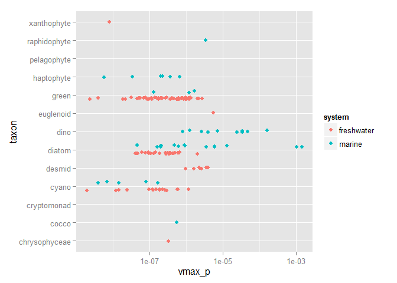

# phytotraitr
Andrew M. Dolman  
`r format(Sys.time(), "%d %B, %Y")`  

## Usage


```r
#kable(Edwards_nutrient_traits[1:10,])

kable(Edwards_nutrient_traits_meta, format = "markdown")
```


|Column name |Variable definition                       |Units                                   |Storage type   |
|:-----------|:-----------------------------------------|:---------------------------------------|:--------------|
|species     |Species name                              |NA                                      |text string    |
|isolate     |Isolate ID                                |NA                                      |text string    |
|taxon       |Taxon name                                |NA                                      |text string    |
|system      |Freshwater/marine                         |NA                                      |text string    |
|temperature |Culture temperature                       |<U+00B0>C                               |floating point |
|irradiance  |Culture irradiance                        |<U+00B5>mol photons m^-2^ s^-1^         |floating point |
|light_hours |Culture daylength                         |hr                                      |integer        |
|synonym     |Former species name                       |NA                                      |text string    |
|volume      |Cell volume                               |<U+00B5>m^3^                            |floating point |
|c_per_cell  |Carbon per cell                           |<U+00B5>mol cell^-1^                    |floating point |
|c_citation  |C per cell citation                       |integer                                 |integer        |
|mu_inf_amm  |<U+00B5> = for ammonium-limited growth    |day^-1^                                 |floating point |
|mu_amm      |<U+00B5>~max~ for ammonium-limited growth |day^-1^                                 |floating point |
|k_amm_m     |K~m~ for ammonium-limited growth          |<U+00B5>mol L^-1^                       |floating point |
|k_amm       |K for ammonium uptake                     |<U+00B5>mol L^-1^                       |floating point |
|vmax_amm    |V~max~ for ammonium uptake                |<U+00B5>mol N cell^-1 day^-1^           |floating point |
|vmax_amm_c  |V~max~ :C for ammonium uptake             |<U+00B5>mol N <U+00B5>mol C^-1^ day^-1^ |floating point |
|qmin_amm    |Q~min~ for ammonium-limited growth        |<U+00B5>mol N cell^-1^                  |floating point |


```r
p <- Edwards_nutrient_traits %>% 
  ggplot(aes(x = taxon, y = `vmax_p`, fill = system, colour=system)) +
  geom_point(position = position_jitterdodge(jitter.width = 0.2)) + 
  coord_flip() +
#  facet_wrap(~system, scales = "fixed") + 
  scale_y_continuous(trans = "log10")
p
```

```
## Warning: Removed 240 rows containing missing values (geom_point).
```

 

