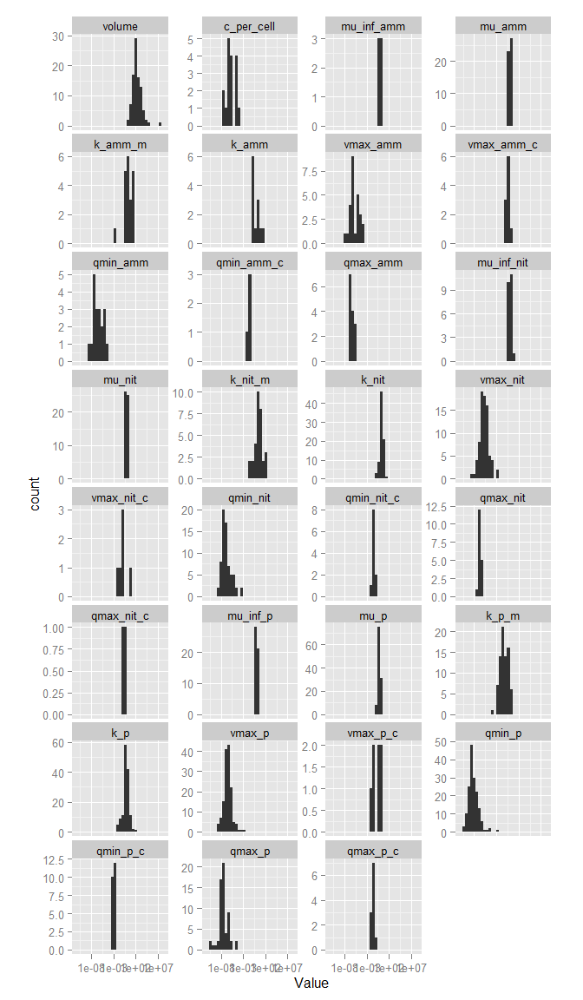

# phytotraitr
Andrew M. Dolman  
`r format(Sys.time(), "%d %B, %Y")`  

## Usage


```r
kable(Edwards_nutrient_traits[1:10,])
```


species                   isolate      taxon    system        temperature   irradiance   light_hours  synonym                  volume   c_per_cell   c_citation   mu_inf_amm   mu_amm   k_amm_m   k_amm   vmax_amm   vmax_amm_c   qmin_amm   qmin_amm_c   qmax_amm  qmax_amm_c    mu_inf_nit   mu_nit   k_nit_m   k_nit   vmax_nit   vmax_nit_c   qmin_nit   qmin_nit_c   qmax_nit   qmax_nit_c   mu_inf_p    mu_p       k_p_m    k_p   vmax_p   vmax_p_c   qmin_p    qmin_p_c   qmax_p   qmax_p_c   citation
------------------------  -----------  -------  -----------  ------------  -----------  ------------  ----------------------  -------  -----------  -----------  -----------  -------  --------  ------  ---------  -----------  ---------  -----------  ---------  -----------  -----------  -------  --------  ------  ---------  -----------  ---------  -----------  ---------  -----------  ---------  ------  ----------  -----  -------  ---------  -------  ----------  -------  ---------  ---------
Cyclotella cryptica       SAG 1070-1   diatom   freshwater           20.0     60.00000            16  NA                           NA           NA           NA           NA       NA        NA      NA         NA           NA         NA           NA         NA  NA                    NA       NA        NA      NA         NA           NA         NA           NA         NA           NA         NA      NA          NA   2.13    7e-07         NA        0          NA       NA         NA          1
Nitzschia closterium      NA           diatom   marine               20.0     60.00000            16  NA                           NA           NA           NA           NA       NA        NA      NA         NA           NA         NA           NA         NA  NA                    NA       NA        NA      NA         NA           NA         NA           NA         NA           NA         NA      NA          NA   0.47    9e-07         NA        0          NA       NA         NA          1
Planktothrix agardhii     NA           cyano    freshwater           24.0     37.00000            24  NA                           NA           NA           NA           NA       NA        NA      NA         NA           NA         NA           NA         NA  NA                    NA     0.46    0.0357      NA         NA           NA         NA           NA         NA           NA         NA   0.540   0.0355000     NA       NA         NA       NA          NA       NA         NA          2
Planktothrix agardhii     NA           cyano    freshwater           15.5     37.00000            NA  NA                           NA           NA           NA           NA       NA        NA      NA         NA           NA         NA           NA         NA  NA                    NA       NA        NA      NA         NA           NA         NA           NA         NA           NA         NA   0.640   0.0283871     NA       NA         NA       NA          NA       NA         NA          3
Planktothrix agardhii     NA           cyano    freshwater           20.5     37.00000            NA  NA                           NA           NA           NA           NA       NA        NA      NA         NA           NA         NA           NA         NA  NA                    NA       NA        NA      NA         NA           NA         NA           NA         NA           NA         NA   0.590   0.0090323     NA       NA         NA       NA          NA       NA         NA          3
Planktothrix agardhii     NA           cyano    freshwater           25.5     37.00000            NA  NA                           NA           NA           NA           NA       NA        NA      NA         NA           NA         NA           NA         NA  NA                    NA       NA        NA      NA         NA           NA         NA           NA         NA           NA         NA   0.480   0.0167742     NA       NA         NA       NA          NA       NA         NA          3
Planktothrix agardhii     NA           cyano    freshwater           15.4     66.40000            24  Oscillatoria agardhii        NA           NA           NA           NA       NA        NA      NA         NA           NA         NA           NA         NA  NA                 0.653       NA        NA      NA         NA           NA         NA        0.059         NA           NA         NA      NA          NA     NA       NA         NA       NA   0.0011100       NA         NA          4
Scenedesmus quadricauda   NA           green    freshwater            5.0     16.60578            24  NA                           NA           NA           NA           NA       NA        NA      NA         NA           NA         NA           NA         NA  NA                    NA       NA        NA      NA         NA           NA         NA           NA         NA           NA      0.275   0.281   0.0190323     NA       NA         NA       NA   0.0008516       NA         NA          5
Scenedesmus quadricauda   NA           green    freshwater           10.0     33.21156            24  NA                           NA           NA           NA           NA       NA        NA      NA         NA           NA         NA           NA         NA  NA                    NA       NA        NA      NA         NA           NA         NA           NA         NA           NA      0.383   0.358   0.0122581     NA       NA         NA       NA   0.0006271       NA         NA          5
Scenedesmus quadricauda   NA           green    freshwater           15.0    116.24045            24  NA                           NA           NA           NA           NA       NA        NA      NA         NA           NA         NA           NA         NA  NA                    NA       NA        NA      NA         NA           NA         NA           NA         NA           NA      0.594   0.623   0.0170968     NA       NA         NA       NA   0.0004978       NA         NA          5

```r
kable(Edwards_nutrient_traits_meta)
```


Column name   Variable definition                         Units                                     Storage type   
------------  ------------------------------------------  ----------------------------------------  ---------------
species       Species name                                NA                                        text string    
isolate       Isolate ID                                  NA                                        text string    
taxon         Taxon name                                  NA                                        text string    
system        Freshwater/marine                           NA                                        text string    
temperature   Culture temperature                         <U+00B0>C                                 floating point 
irradiance    Culture irradiance                          <U+00B5>mol photons m^-2^ s^-1^           floating point 
light_hours   Culture daylength                           hr                                        integer        
synonym       Former species name                         NA                                        text string    
volume        Cell volume                                 <U+00B5>m^3^                              floating point 
c_per_cell    Carbon per cell                             <U+00B5>mol cell^-1^                      floating point 
c_citation    C per cell citation                         integer                                   integer        
mu_inf_amm    <U+00B5> = for ammonium-limited growth      day^-1^                                   floating point 
mu_amm        <U+00B5>~max~ for ammonium-limited growth   day^-1^                                   floating point 
k_amm_m       K~m~ for ammonium-limited growth            <U+00B5>mol L^-1^                         floating point 
k_amm         K for ammonium uptake                       <U+00B5>mol L^-1^                         floating point 
vmax_amm      V~max~ for ammonium uptake                  <U+00B5>mol N cell^-1 day^-1^             floating point 
vmax_amm_c    V~max~ :C for ammonium uptake               <U+00B5>mol N <U+00B5>mol C^-1^ day^-1^   floating point 
qmin_amm      Q~min~ for ammonium-limited growth          <U+00B5>mol N cell^-1^                    floating point 


```r
p <- Edwards_nutrient_traits %>% 
  ggplot(aes(x = taxon, y = `vmax_p`, fill = system, colour=system)) +
  geom_point(position = position_jitterdodge(jitter.width = 0.2)) + 
  coord_flip() +
#  facet_wrap(~system, scales = "fixed") + 
  scale_y_continuous(trans = "log10")
p
```

```
## Warning: Removed 240 rows containing missing values (geom_point).
```

 

