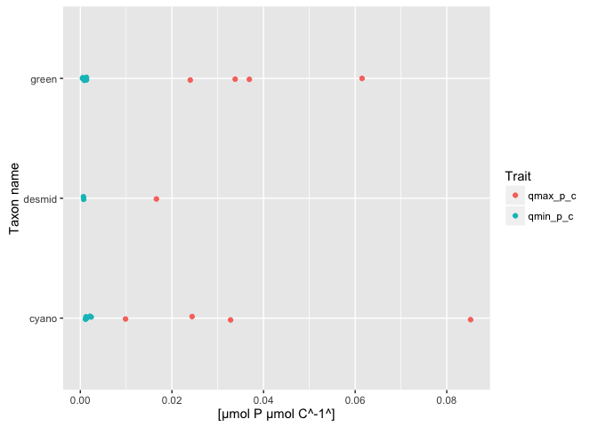

# phytotraitr
*********************
This package contains a compilation of compilations of published phytoplankton trait data. 

## Contents:

* Nutrient uptake traits from Edwards et al (2015)
* Thermal traits from Chen (2015)
* Cell and natural unit biovolumes from Kremer et al (2014)


[Chen B. (2015) Patterns of thermal limits of phytoplankton. Journal of Plankton Research 37, 285-292.](http://www.plankt.oxfordjournals.org/cgi/doi/10.1093/plankt/fbv009)

[Edwards K.F., Klausmeier C.A. & Litchman E. (2015) Nutrient utilization traits of phytoplankton. Ecology 96, 2311-2311.](http://www.esajournals.org/doi/abs/10.1890/14-2252.1)

[Kremer C.T., Gillette J.P., Rudstam L.G., Brettum P. & Ptacnik R. (2014) A compendium of cell and natural unit biovolumes for >1200 freshwater phytoplankton species. Ecology 95, 2984.](http://www.esajournals.org/doi/abs/10.1890/14-0603.1)

## Installation

phytotraitr is not available from CRAN.

You can install directly from github with:
```R
# install.packages("devtools")
devtools::install_github("andrewdolman/phytotraitr")
```

## Usage


Each table has a corresponding *_key table with details about each variable. The first three columns of the keys are also found in the help files for each table.


```r
kable(Edwards_nutrient_traits[1:10,1:6], format = "markdown")
```


|species                 |isolate    |taxon  |system     | temperature| irradiance|
|:-----------------------|:----------|:------|:----------|-----------:|----------:|
|Cyclotella cryptica     |SAG 1070-1 |diatom |freshwater |        20.0|   60.00000|
|Nitzschia closterium    |NA         |diatom |marine     |        20.0|   60.00000|
|Planktothrix agardhii   |NA         |cyano  |freshwater |        24.0|   37.00000|
|Planktothrix agardhii   |NA         |cyano  |freshwater |        15.5|   37.00000|
|Planktothrix agardhii   |NA         |cyano  |freshwater |        20.5|   37.00000|
|Planktothrix agardhii   |NA         |cyano  |freshwater |        25.5|   37.00000|
|Planktothrix agardhii   |NA         |cyano  |freshwater |        15.4|   66.40000|
|Scenedesmus quadricauda |NA         |green  |freshwater |         5.0|   16.60578|
|Scenedesmus quadricauda |NA         |green  |freshwater |        10.0|   33.21156|
|Scenedesmus quadricauda |NA         |green  |freshwater |        15.0|  116.24045|

```r
kable(Edwards_nutrient_traits_key[1:6,], format = "markdown")
```


|Column name |Variable definition |Units                    |Storage type   |
|:-----------|:-------------------|:------------------------|:--------------|
|species     |Species name        |text                     |string         |
|isolate     |Isolate ID          |text                     |string         |
|taxon       |Taxon name          |text                     |string         |
|system      |Freshwater/marine   |text                     |string         |
|temperature |Culture temperature |°C                       |floating point |
|irradiance  |Culture irradiance  |µmol photons m^-2^ s^-1^ |floating point |

### Minimum and maximum P cell quotas for freshwater taxa


```r
p <- Edwards_nutrient_traits %>% 
  filter(system == "freshwater") %>%
  select(taxon, qmin_p_c, qmax_p_c) %>% 
  gather(Trait, Value, -taxon) %>% 
  filter(complete.cases(Value)) %>% 
  ggplot(aes(x = taxon, y = Value, colour = Trait)) %>% 
  + geom_point(position = position_jitter(width = 0.05)) %>% 
  + coord_flip() %>% 
  + scale_x_discrete(with(Edwards_nutrient_traits_key, Edwards_nutrient_traits_key[`Column name`=="taxon","Variable definition"])) %>% 
  + scale_y_continuous(paste0("[",
                              Edwards_nutrient_traits_key[Edwards_nutrient_traits_key$`Column name`=="qmin_p_c","Units"],
                              "]"),
                       trans = "log10")
p
```

 


## Consistency

The data from the separate publications have not been harmonized - i.e. variable names may differ (e.g. species, Species) and they may use different taxonomy.


## Full list of dataframes


```r
sets <- data(package = "phytotraitr")  
sets <- data.frame(sets[[3]])  %>% 
  select(Item, Title)

kable(sets, format = "markdown")
```


|Item                           |Title                                                                                                      |
|:------------------------------|:----------------------------------------------------------------------------------------------------------|
|Chen_thermal_traits            |Chen (2015) Thermal Traits.                                                                                |
|Chen_thermal_traits_key        |Chen (2015) Thermal Traits key                                                                             |
|Chen_thermal_traits_references |Chen (2015) Thermal Traits references.                                                                     |
|Edwards_cell_volumes           |Cell volumes of phytoplankton.                                                                             |
|Edwards_cell_volumes_key       |                                                                                                           |
|Edwards_citations              |Citation information for nutrient utilization traits.                                                      |
|Edwards_nutrient_traits        |Nutrient utilization traits of phytoplankton.                                                              |
|Edwards_nutrient_traits_key    |                                                                                                           |
|Kremer_raw                     |Phytoplankton cell and natural unit biovolumes. Raw biovolume data - pre quality control.                  |
|Kremer_raw_key                 |                                                                                                           |
|Kremer_taxa                    |Phytoplankton cell and natural unit biovolumes. Taxonomic look-up table based on ITIS classifications      |
|Kremer_taxa_key                |                                                                                                           |
|Kremer_volumes_genus           |Phytoplankton cell and natural unit biovolumes. Genus-level biovolume data.                                |
|Kremer_volumes_genus_agg       |Phytoplankton cell and natural unit biovolumes. Genus-level aggregated biovolume data and full taxonomy.   |
|Kremer_volumes_genus_agg_key   |                                                                                                           |
|Kremer_volumes_genus_key       |                                                                                                           |
|Kremer_volumes_species         |Phytoplankton cell and natural unit biovolumes. Species-level biovolume data.                              |
|Kremer_volumes_species_agg     |Phytoplankton cell and natural unit biovolumes. Species-level aggregated biovolume data and full taxonomy. |
|Kremer_volumes_species_agg_key |                                                                                                           |
|Kremer_volumes_species_key     |                                                                                                           |

